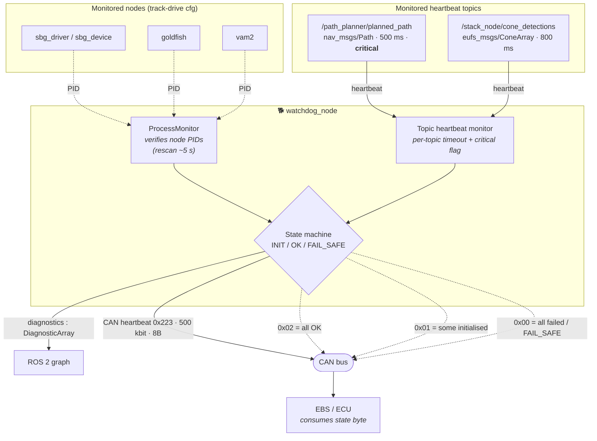
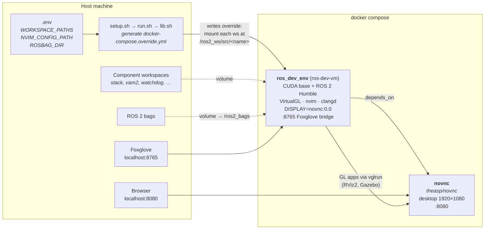
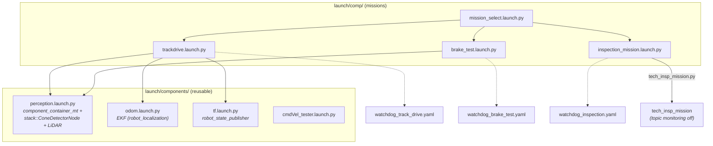

# UQRacing Autonomous Stack — Architecture Map

> A visual map of how the programs, ROS 2 topics/messages, the watchdog, and the
> Docker environment interact across the UQRacing driverless vehicle software.
>
> **Source:** reconstructed from `UQRacing/uqracing-docker`, `uqr_ws`, `watchdog`,
> `mission_launchers`, and the component repos. Because the source repos sit outside
> this site's repository, the map was rebuilt from GitHub code-search fragments.
> Solid lines / boxes are **CONFIRMED** (seen directly in source). Dashed lines /
> boxes marked _(inferred)_ are **INFERRED** or come from repos that GitHub code
> search could not index — see [Gaps](#confidence--gaps).

---

## 1. The big picture — end-to-end data flow

This is the perception → planning → control → actuation pipeline, plus the
supervision (watchdog) and telemetry taps that hang off it.

```mermaid
flowchart LR
    %% ---------- Sensors ----------
    subgraph SENSORS["🛰️ Sensors / Drivers"]
        cam["FLIR camera driver<br/><i>flir_camera_driver_ros2</i>"]
        lidar["LiDAR driver<br/><i>lslidar_ros2</i>"]
        ins["SBG INS<br/><i>sbg_driver / sbg_device</i>"]
    end

    %% ---------- Perception ----------
    subgraph PERCEPTION["👁️ Perception"]
        conenet["conenet_ros<br/><i>camera cone detect (YOLOv5)</i>"]
        conedet["cone_detector<br/><b>ConeDetectorNode</b><br/><i>LiDAR → cones (C++)</i>"]
        stack["stack_node<br/><b>stack::ConeDetectorNode</b><br/><i>perception (stack monorepo)</i>"]
        vape["vape2<br/><i>3D cone position est. (inferred)</i>"]
    end

    %% ---------- Fusion + Planning ----------
    subgraph PLANNING["🧭 Fusion & Path Planning"]
        goldfish["goldfish<br/><i>cone fusion (path_planner_unknown)</i>"]
        planner["delaunay_path_planner_node<br/><i>Delaunay path planner</i>"]
    end

    %% ---------- Control ----------
    subgraph CONTROL["🎯 Control"]
        follower["path_follower<br/><i>trajectory follower</i>"]
        ctrl["stanley_steering /<br/>pure-pursuit<br/><i>(controllers, inferred)</i>"]
    end

    %% ---------- Actuation ----------
    subgraph ACTUATION["⚙️ Actuation"]
        vam2["vam2<br/><i>Vehicle Actuation Manager (C++)</i>"]
        xbox["xbox / cmdVel_tester<br/><i>manual control</i>"]
    end

    %% ---------- Localization ----------
    subgraph LOCALIZATION["📍 Localization"]
        ekf["odom_filter_node<br/><i>robot_localization EKF</i>"]
        rsp["robot_state_publisher<br/><i>TF</i>"]
        bicycle["bicycle_model<br/><i>kinematic model</i>"]
    end

    %% ---------- CAN / hardware ----------
    subgraph HW["🔌 CAN bus / Vehicle HW"]
        can(["CAN bus"])
        amk["AMK inverters"]
        motec["MoTeC ECU"]
        dfmm["DFMM<br/><i>Driverless Fault Mgmt Module</i>"]
        dash["Dashboard display"]
    end

    %% ---------- Telemetry / Debug ----------
    subgraph TELEM["📡 Telemetry & Debug"]
        dashdbg["dash_debug<br/><i>ROS values → CAN → dash</i>"]
    end

    %% ===== Edges: sensors -> perception =====
    cam -->|"/flir_camera/image_raw : Image"| conenet
    lidar -->|"PointCloud2"| conedet
    lidar -->|"PointCloud2"| stack

    %% ===== perception -> fusion =====
    conenet -->|"/VAPE/cones : NNConeDetections"| vape
    vape -.->|"/fusion/cones : ConeArray (inferred)"| goldfish
    conedet -->|"ConeArray : eufs_msgs/ConeArray"| goldfish
    stack -->|"/stack_node/cone_detections : ConeArray"| goldfish

    %% ===== fusion -> planning =====
    goldfish -->|"ConeArray + /goldfish/cones : ConeArrayWithCovariance"| planner
    goldfish -->|"/goldfish/cones : ConeArrayWithCovariance"| dashdbg

    %% ===== planning -> control =====
    planner -->|"/path_planner/planned_path : nav_msgs/Path"| follower
    planner -.->|"planned_path (inferred)"| ctrl

    %% ===== control -> actuation =====
    follower -->|"/vam/cmdVel : AckermannDrive"| vam2
    ctrl -.->|"/vam/cmdVel (inferred)"| vam2
    xbox -->|"/vam/cmdVel : CmdVel<br/>/vam/softEbs : Safety"| vam2
    follower -->|"/vam/cmdVel : AckermannDrive"| dashdbg

    %% ===== actuation -> CAN =====
    vam2 -->|"AMK + MoTeC frames"| can
    vam2 -->|"/dfmm/status : AVStatus"| dfmm
    dfmm -->|"/dfmm/mission_finished : UInt8"| vam2
    can --- amk
    can --- motec
    dashdbg -->|"CAN frames"| can
    can --- dash

    %% ===== localization =====
    ins -->|"odometry"| ekf
    can -->|"wheel/CAN data"| bicycle
    bicycle -.->|"Odometry"| ekf
    ekf -.->|"odom / TF"| planner
    rsp -.->|"TF"| ekf

    classDef inferred stroke-dasharray:5 5,stroke:#888,fill:#f3f3f3,color:#555;
    class vape,ctrl inferred;
```

---

## 2. Watchdog supervision

The `watchdog_node` (Python, in `UQRacing/watchdog`) runs **separately** from the
stack — the mission launchers start the actual nodes; the watchdog only supervises
them. It checks two things and reports vehicle health over CAN to the fault-management
hardware.

**CAN heartbeat payload (state byte):**

| Byte value | Meaning |
|---|---|
| `0x02` | All monitored nodes running normally |
| `0x01` | Some nodes initialised (partial) |
| `0x00` | All failed / watchdog in `FAIL_SAFE` |

CAN frame: arbitration id `0x223` (11-bit), bitrate `500000`, DLC `8`. The watchdog
does **not** publish a ROS e-stop topic — it signals state over CAN and the
EBS/ECU acts on `0x00`. Config files: `watchdog_track_drive.yaml`,
`watchdog_brake_test.yaml`, `watchdog_inspection.yaml`.

---

## 3. Docker environment

How the whole thing runs on a dev machine — ROS 2 **Humble**, GPU-accelerated, with
a browser-based desktop.

- **`ros_dev_env`** (`ros-dev-vm`): built from the local Dockerfile on a CUDA base
  image. ROS 2 Humble apt repo, VirtualGL for GPU GL, Neovim + clangd for editing.
  `EUFS_MASTER=/ros2_ws/src`, sources `/opt/ros/humble/setup.bash`. Exposes Foxglove
  bridge on `127.0.0.1:8765`.
- **`novnc`** (`theasp/novnc`): browser desktop at `127.0.0.1:8080` so GL tools render
  remotely; `ros_dev_env` points `DISPLAY` at it.
- Each component workspace is bind-mounted under `/ros2_ws/src/<folder>/` via the
  generated `docker-compose.override.yml`; bags mount at `/ros2_bags`.

---

## 4. Mission launch composition

`mission_launchers` wires reusable launch blocks into full missions.

> Acceleration / skidpad / autocross launch files were not found by name in the
> search index — see Gaps.

---

## 5. Node / program inventory

| Node / program | Repo | Lang | Role |
|---|---|---|---|
| `conenet_ros` | conenet_ros | Python (YOLOv5) | Camera cone detection → bounding boxes |
| `ConeDetectorNode` | cone_detector | C++ | LiDAR `PointCloud2` → ground filter → `ConeArray` |
| `stack::ConeDetectorNode` (`stack_node`) | stack | C++ (composable) | Perception cone detector used in missions |
| `delaunay_path_planner_node` | path_planner_unknown | C++ | `ConeArray` → `nav_msgs/Path` |
| `goldfish` | path_planner_unknown | Python | Cone fusion → `ConeArray` + markers (watched) |
| `path_follower` | path_planner_unknown | Python | `Path` → `/vam/cmdVel` (AckermannDrive) |
| `vam2` | vam2 | C++ | Vehicle Actuation Manager → AMK/MoTeC over CAN (watched) |
| `dash_debug` | dash_debug | C++ | ROS values → CAN → dashboard |
| `bicycle_model` | AV_Bicycle_Model | Python | Kinematic model; CAN → `Odometry` |
| `cone_eval` (`eval_runner`) | cone_eval | Python | Offline eval: replay `PointCloud2`, score `ConeArray` |
| `watchdog_node` | watchdog | Python | Supervises liveness + heartbeats → CAN + diagnostics |
| `mission_select`, `tech_insp_mission`, `xbox`, `cmdVel_tester` | mission_launchers | Python | Mission orchestration / manual control |
| `odom_filter_node` | robot_localization (3rd-party) | C++ | EKF odometry |
| `robot_state_publisher` | (3rd-party) | C++ | TF from URDF |

**Interface packages:** `uqr_msgs` (e.g. `AVStatus`), `eufs_msgs`
(`ConeArray`, `ConeArrayWithCovariance`), `flir_camera_msgs`. Custom message types
seen in use: `Safety`, `CmdVel`, `VAMSoundRequest`, `HomeMotor`, `NNConeDetections`.

**`uqr_ws` workspace (`.repos`):** `stack`, `path_planner_unknown`, `vam2`,
`mission_launchers`, `lslidar_ros2`, `uqr_msgs`, `flir_camera_driver_ros2`,
`watchdog`, `eufs_msgs`, `bicycle_model` (→ `AV_Bicycle_Model`), `dash_debug`,
`velocity_compensation`. (`colcon.meta` also builds
`spinnaker_synchronized_camera_driver`, `lslidar_ch_driver`.)

---

## 6. ROS topic reference (confirmed edges)

| Publisher | Topic | Message type | Subscriber |
|---|---|---|---|
| FLIR driver | `/flir_camera/image_raw` | `sensor_msgs/Image` | `conenet_ros` |
| `conenet_ros` | `/VAPE/cones` | `NNConeDetections` | `vape2` |
| `conenet_ros` | `/VAPE/markers` | markers / annotated `Image` | viz |
| `cone_detector` | `~/ground_filtered_cloud` | `PointCloud2` | viz / debug |
| `cone_detector` | (cone topic) | `eufs_msgs/ConeArray` | planner / fusion |
| `stack_node` | `/stack_node/cone_detections` | `eufs_msgs/ConeArray` | watchdog, fusion |
| `goldfish` | `/goldfish/cones` | `eufs_msgs/ConeArrayWithCovariance` | `dash_debug` |
| `delaunay_path_planner_node` | `/path_planner/planned_path` | `nav_msgs/Path` | `path_follower`, watchdog |
| `path_follower` | `/vam/cmdVel` | `ackermann_msgs/AckermannDrive` | `vam2`, `dash_debug` |
| `xbox` | `/vam/cmdVel`, `/vam/softEbs`, `/vam/soundRequest`, `/vam/homeMotor` | `CmdVel`, `Safety`, `VAMSoundRequest`, `HomeMotor` | `vam2` |
| `vam2` | `/dfmm/status` | `uqr_msgs/AVStatus` | DFMM |
| DFMM | `/dfmm/mission_finished` | `std_msgs/UInt8` | `vam2` |
| `tech_insp_mission` | (cmd topic), `/dfmm/mission_finished` | `AckermannDrive`, `UInt8` | `vam2` |
| `bicycle_model` | (odom topic) | `nav_msgs/Odometry` | EKF |
| `watchdog_node` | `diagnostics` | `diagnostic_msgs/DiagnosticArray` | ROS graph |

---

## Confidence / Gaps

**Confirmed** (seen directly in source fragments): Docker compose/Dockerfile/scripts;
`uqr_ws` `.repos` inventory; watchdog node, config, and CAN behaviour; mission launch
structure and the perception composable node; the topic edges in the reference table
above.

**Inferred** (dashed in diagrams): the exact end-to-end ordering of the
perception → planning → control chain; that `cone_detector` is the repo informally
called "lidar_processing"; that `stack_node` wraps cone detection inside the `stack`
monorepo; that the watchdog's `0x00` state drives an EBS/e-stop consumer.

**Could not surface** (no GitHub code-search hits — likely un-indexed private repos):
- `lidar_processing`, `vape2`, `glim-stack`, `stanley_steering`,
  `pure-pursuit-trajectory-follower`, `backup_path_planner`, `lora_telem`.
- The **`stack`** monorepo internals (beyond `stack_node` → `/stack_node/cone_detections`).
  Much perception/control logic likely lives here.
- `velocity_compensation`, `flir_camera_driver_ros2`, `lslidar_ros2` internals
  (only listed in `.repos`).
- Acceleration / skidpad / autocross / EBS mission launch files.
- `dash_debug`'s full subscription list (only 2 of many confirmed).

> To upgrade any dashed/inferred edge to confirmed, add the relevant repo to the
> session scope (or run this against a checkout of `uqr_ws` with all repos vendored in)
> and the map can be regenerated with full fidelity.
